# 对象存储授权服务（securityToken）

## 方法对应action

|客户端action|通用action|华为云action|阿里云action|
|:---:|:---:|:---|:---|
|listBuckets|listBuckets|obs:bucket:ListBucket|oss:ListBuckets|
|doesBucketExist|doesBucketExist|obs:bucket:HeadBucket|oss:HeadBucket|
|listObjects|listObjects|obs:*:*|oss:ListObjects|
|getObject|getObject|obs:object:GetObject|oss:GetObject|
|doesObjectExist|doesObjectExist|obs:object:GetObject|oss:GetObject|
|putObject|putObject|obs:object:PutObject|oss:PutObject|
|download*|downloadObject|obs:object:GetObject|oss:GetObject|
|deleteObject|deleteObject|obs:object:DeleteObject|oss:DeleteObject|
|generatePresignedUrl|generatePresignedUrl|不支持|不支持|

## 配置ram/iam 生成配置信息

### aliyun

前往[阿里云文档](https://help.aliyun.com/document_detail/100624.html?spm=5176.8466032.policy.1.74751450DN6TJ7)

1. 用户配置 生成accesskey/secretKey AliyunSTSAssumeRoleAccess
   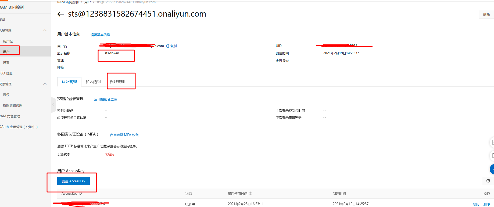   
   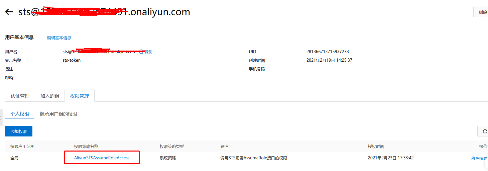

2. 配置ram角色 并授权AliyunOSSFullAccess
   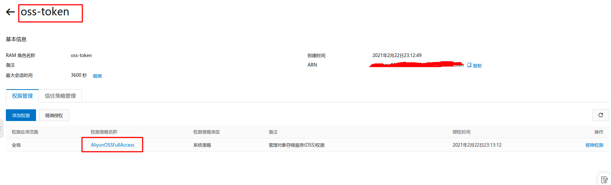

兼容的S3 API Bucket操作：

* Delete Bucket
* Get Bucket（list objects）
* Get Bucket ACL
* Get Bucket lifecycle
* Get Bucket location
* Get Bucket logging
* Head Bucket
* Put Bucket
* Put Bucket ACL
* Put Bucket lifecycle
* Put Bucket logging Object操作：
* Delete Object
* Delete Objects
* Get Object
* Get Object ACL
* Head Object
* Post Object
* Put Object
* Put Object Copy
* Put Object ACL Multipart操作：
* Abort Multipart Upload
* Complete Multipart Upload
* Initiate Multipart Upload
* List Parts
* Upload Part
* Upload Part Copy

> 2019年9月23日0点之后创建的Bucket，以下MimeType 需要在自定义域名下面才能预览（已经设置了Content-Type）； 这个时间点之前创建的不影响。

```
image/jpeg、image/gif、image/tiff、image/png、image/webp、image/svg+xml、image/bmp、image/x-ms-bmp、image/x-cmu-raster、image/exr、image/x-icon、image/heic
```

> 其他问题 请前往[常见问题](https://help.aliyun.com/document_detail/39545.htm?spm=a2c4g.11186623.2.19.15b51a21md6bku)

### huaweicloud

前往[华为云文档](https://support.huaweicloud.com/devg-obs/obs_06_0013.html)

1. 进入统一身份认证 用户配置 生成accesskey/secretKey 并关联角色（权限）
   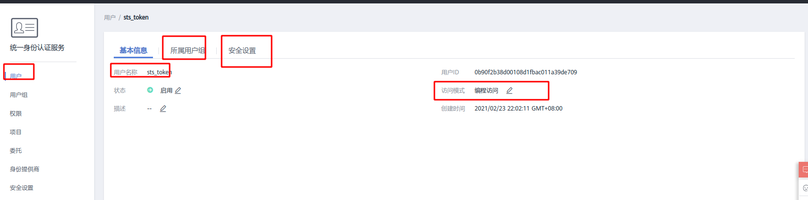
   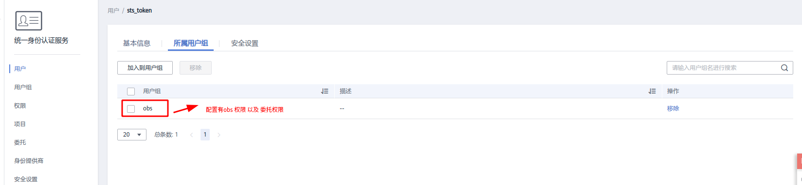
   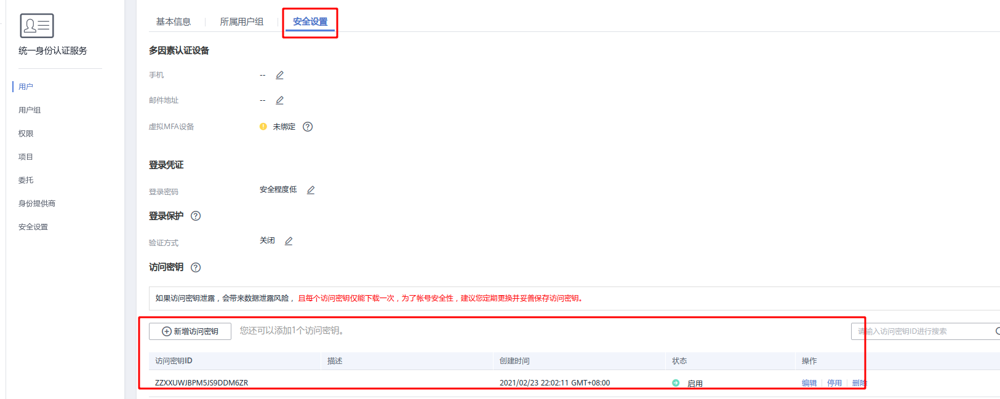
   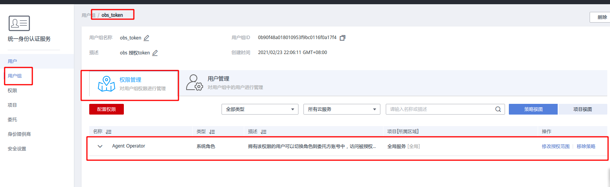'

2. 配置ram角色 并授权AliyunOSSFullAccess
   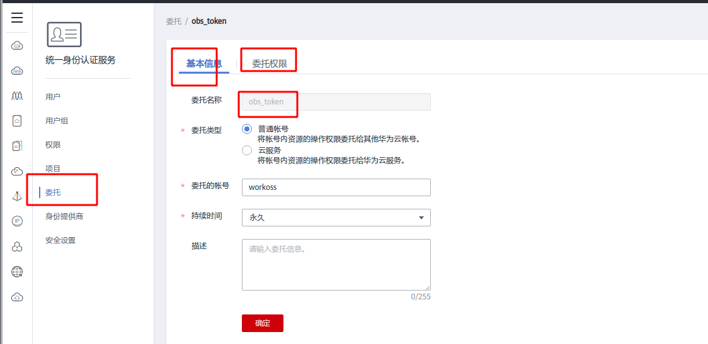
   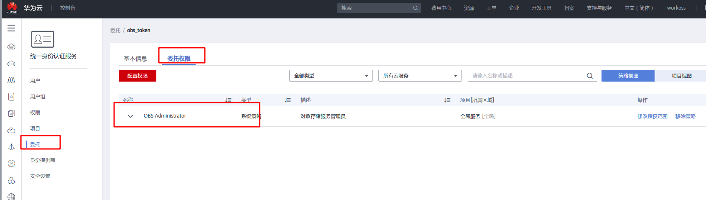

### tencentcloud  TODO

[前往腾讯云文档](https://cloud.tencent.com/document/product/436/14048)

## 启动服务端

> 执行命令

```shell
java -jar storage-server-xxx.jar --spring.config.location=classpath:/application.yml
```

> 其中application.yml

```yaml
server:
  #port
  port: 8088
spring:
  messages:
    encoding: UTF-8
    # 参数校验+i18n属性文件
    basename: i18n/message,i18n/valid
    fallback-to-system-locale: true
  jackson:
    date-format: yyyy-MM-dd HH:mm:ss
  webflux:
    # 自定义objectMapper反序列化 LocalDateTime LocalDate LocalTime
    format:
      date-time: yyyy-MM-dd HH:mm:ss
      date: yyyy-MM-dd
      time: HH:mm:ss
    base-path: /storage
  r2dbc:
    name: r2dbc
    # 数据库链接 mysql 只需要替换x,port,database
    url: r2dbc:mariadb://x.x.x.x:port/database?serverTimezone=Asia/Shanghai
    username: username
    password: password
    properties:
      lock_timeout: 40000
      statement_timeout: 40000
      idle_in_transaction_session_timeout: 40000
    pool:
      enabled: true
      max-size: 20
      initial-size: 4
  data:
    r2dbc:
      repositories:
        enabled: true
logging:
  level:
    org:
      springframework:
        r2dbc: DEBUG
```

> 数据库文件

会自动建表，数据示例

```sql
INSERT INTO storage_account (id, account_type, access_key, config, policy_template, state, tenant_id,
                             create_time, modify_time)
VALUES (1612768695130, 'OSS', 'LTAI4G3Apnzprof18S52qTs7', '{"access_key":"access_key",
        "secret_key":"secret_key", "region":"cn-shenzhen",
        "role_arn":"acs:ram::111111:role/oss-token", "session_name":"popeye", "token_duration_seconds":"1200",
        "max_upload_size":"10485760000"}', '{"Version":"1", "Statement":[{"Effect":"Allow",
        "Action":["oss:{{action}}"], "Resource":["acs:oss:*:*:{{resource}}"]}]}', 'ON', 'default',
        '2021-02-19 14:41:09', '2021-02-19 14:41:11');
INSERT INTO storage_account (id, account_type, access_key, config, policy_template, state, tenant_id,
                             create_time, modify_time)
VALUES (1612768695132, 'OBS', 'ZZXXUWJBPM5JS9DDM6ZR', '{"access_key":"access_key",
        "secret_key":"secret_key", "region":"cn-south-1", "agency_name":"obs_token",
        "domain_name":"workoss", "session_name":"popeye", "token_duration_seconds":"1200",
        "max_upload_size":"10485760000"}', '{"Version":"1.1", "Statement":[{"Action":["obs:{{action}}"],
        "Effect":"Allow", "Resource":["obs:*:*:*:{{resource}}"]}]}', 'ON', 'default', '2021-02-24 08:58:29',
        '2021-02-24 08:58:31');
```

|字段|类型|是否必填|示例|描述|
|:---|:---:|:---:|:---|:---|
|id|string|是||主键|
|account_type|enum|是|OSS/OBS/COB/S3等|账号类型|
|access_key|string|是| |账号ak|
|config|string|是| |账号配置信息|
|policy_template|string|是| |ak+sk+securityToken授权模板|
|state|enum|是|ON/OFF|状态|
|tenant_id|string|是|default|租户ID 当前默认default|
|createTime|datetime|是| |创建时间|
|modify_time|datetime|是| |修改时间|

> config字段说明

_***没有特殊说明就是共有***_

|字段|类型|账号类别|是否必填|示例|描述|
|:---|:---:|:---:|:---:|:---|:---|
|access_key|string| |是| |账号ak|
|secret_key|string| |是| |账号sk|
|region|string| |是| |账号regionId|
|role_arn|string|OSS|是| |阿里云ram OSS必有|
|agency_name|string|OBS|是| |华为云 必有|
|session_name|string| |否| |哪个应用申请授权|
|domain_name|string|OBS|是| |华为云 必有|
|token_duration_seconds|string| |否| |token过期时间 默认1200（20分钟）|
|max_upload_size|string| |否| |上传大小|

## 签名api

> 签名服务

***POST storage/security/stssign***

> 参数

|参数|类型|是否必填|示例|描述|
|:---|:---:|:---:|:---|:---|
|storageType|enum|是|OSS（阿里云）/OBS（华为云）|对象存储类型|
|bucketName|string|是||存储桶/bucket|
|key|string|是|/11/22/demo.text|文件路径（包括文件名称）|
|mimeType|string|否|text/plain|文件类型，可以空，空的时候程序会根据key自动获取|
|successActionStatus|string|否|200|上传返回状态|

```json
{
  "storageType": "OBS",
  "bucketName": "workoss",
  "key": "demo/demo.txt",
  "successActionStatus": "200"
}
```

> 返回结果

|参数|类型|示例|描述|
|:---|:---:|:---|:---|
|code|string|0|0正常，其他错误|
|message|string| |错误描述|
|data|object| |签名对象|
|data.storageType|enum|OSS(阿里云)/OBS(华为云)|对象存储类型|
|data.accessKey|string| |OSSAccessKeyId(OSS上传参数),AccessKeyId(OBS上传参数)|
|data.stsToken|string| |ak/sk/securityToken签名 有值 OSS上传参数(x-oss-security-token) OBS上传参数(x-obs-security-token)|
|data.policy|string| |policy|
|data.signature|string| |signature|
|data.key|string|11/demo.conf|文件名称(包括路径)|
|data.host|string|https://workoss.oss-cn-shenzhen.aliyuncs.com|域名(不是自定义域名)|
|data.mimeType|string|text/plain|文件类型 contentType;OBS上传(form body content-type),OSS(x-oss-content-type)|
|data.expire|long|1614238325615|过期时间|
|data.successActionStatus|string|200|form上传成功返回状态 OSS/OBS上传参数(success_action_status)|

```json
{
  "code": "0",
  "message": "OK",
  "data": {
    "storageType": "OBS",
    "accessKey": "accessKey",
    "stsToken": "stsToken",
    "policy": "policy",
    "signature": "signature",
    "key": "demo/demo.txt",
    "host": "https://workoss.obs.cn-south-1.myhuaweicloud.com",
    "expire": 1614656943151,
    "mimeType": "text/plain",
    "successActionStatus": "200"
  }
}
```

* oss form 上传
  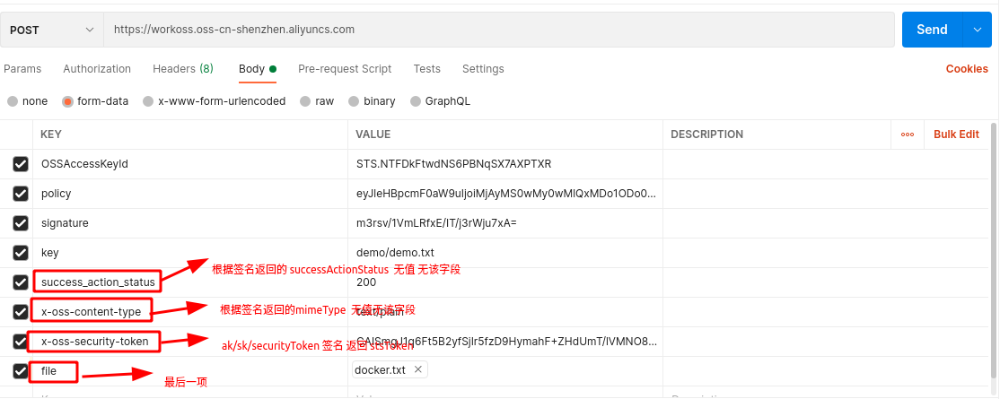

* obs form 上传
  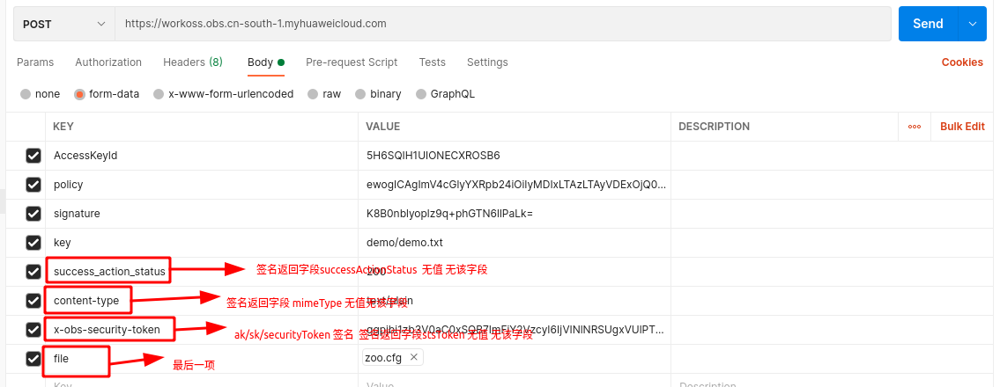

##### ak/sk 方式

* oss form 上传
  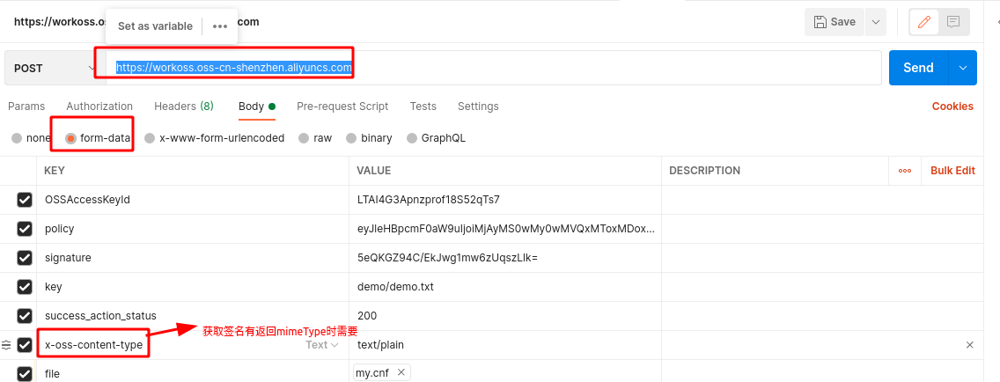

* obs form 上传
  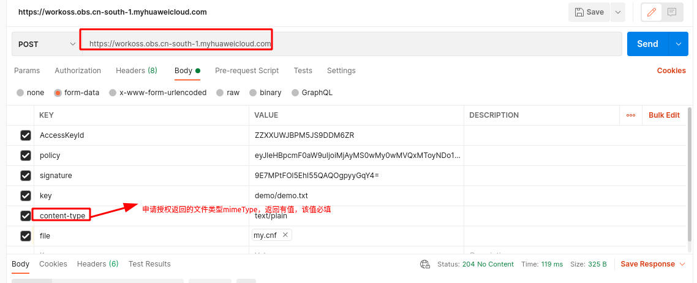